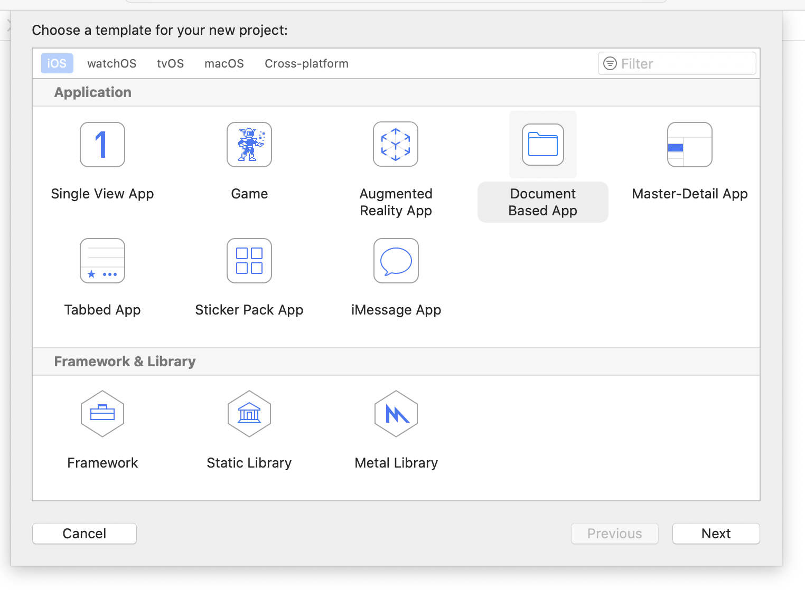
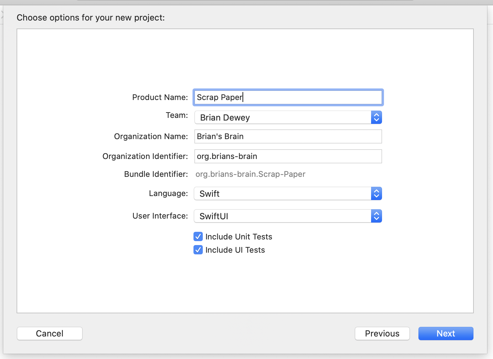
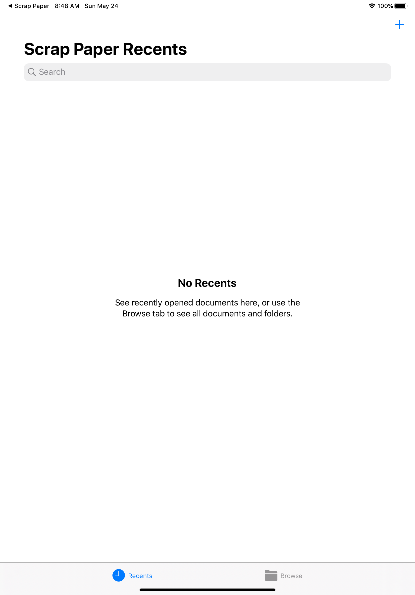
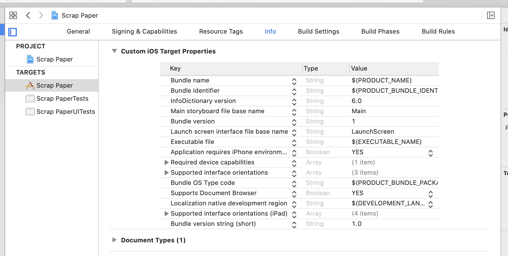

# Welcome to Scrap Paper

The goal of the Scrap Paper tutorial series is to walk you through the steps in creating a simple notes / writing app — something like Bear, Ulysses, or iA Writer. The nice thing about a notes app is that it’s simple enough to explain, really easy to get started, yet offers a ton to explore. I’ve been building my own personal notes app for over a year now, and I’ve found it’s been a great vehicle for trying my hand at new technology. From core computer science concepts like parsing expression grammars and conflict-free replicated data types to Apple-specific technology like SwiftUI and iCloud syncing, a notes app lets you explore them all.

I’ve written this tutorial assuming you’re following along in Xcode and creating your own project / source code. Additionally, you can refer to snapshots of my copy of the code.

### A note about what we’re going to build
Scrap Paper embraces the “plain text” ethos. The mental model it supports is “my notes are just text files in a directory,” and in the early stages of the tutorial that will be the implementation. (Later steps will explore the tradeoffs of storing the notes in a database.) Like many iOS writing apps, Scrap Paper will support simple formatting, links, and embedded images through Markdown-inspired syntax. Notes locked to a single device aren’t that useful, so Scrap Paper will use iCloud to synchronize notes across your devices.

### Prerequisites
* I assume you know the basics of Swift — this isn’t a language tutorial.
* I assume you know the *concepts* behind SwiftUI. I don’t think anyone’s an *expert* at SwiftUI yet, so we’ll be discovering things about SwiftUI together.

## Let’s edit some files!
You’ve got to start somewhere! For the first step in our notes app, we’re going to write an app that can edit plain text files.

1. **Start with a Document Based App**. This is the most fun part of any new programming endeavor: Opening Xcode and doing File -> New Project. Select the **Document Based App** project template. 


2. Pick your product name. (I’m using *Scrap Paper*.) The language is **Swift** and the User Interface is **SwiftUI**. Include Unit & UI tests because you’re a responsible engineer.


You now have something you can build & run. It’ll bring up the standard iOS Document Browser, but otherwise does nothing.



3. **Get rid of main.storyboard** I don’t use storyboards, and this project won’t, either.
	1. Delete **main.storyboard**
	2. Go to Project Properties -> Info and delete **Main storyboard file base name**

	3. In `AppDelegate.swift`, update `application(_:didFinishLaunchingWithOptions:)` to the following:

```swift
  func application(
    _ application: UIApplication,
    didFinishLaunchingWithOptions launchOptions: [UIApplication.LaunchOptionsKey: Any]?
  ) -> Bool {
    let window = UIWindow(frame: UIScreen.main.bounds)
    window.rootViewController = DocumentBrowserViewController(forOpeningFilesWithContentTypes: nil)
    window.makeKeyAndVisible()
    self.window = window
    return true
  }
```

At this point, you can build & run the app again. It will still run, still do nothing, but at this point it no longer uses storyboards.

## Creating Plain Text Files
Now that the basic scaffolding of Scrap Paper is in place, it’s time to make it actually *do* something. As a first step, we’ll tell the `UIDocumentBrowserViewController` how to create new plain text files.

The Xcode project scaffolding created `DocumentBrowserViewController` for us — this class is both a subclass of `UIDocumentBrowserViewController` *and* the delegate for that class. 

When someone taps on the **+** button in the document browser, the browser sends the `documentBrowser(_:didRequestDocumentCreationWithHandler:)` message to the delegate. The delegate needs to create a new file in a temporary location and and then call the completion handler with the URL of the new file. The UIDocumentBrowserViewController will then import the new file into the application sandbox.

Here’s a simple implementation of this delegate method. It creates a new temporary directory each time it is called and creates a file named `scrap.txt` in that directory. If everything works correctly, it tells the browser to move the file from the temporary location into the application sandbox. Note it’s important to *always* call `importHandler`, so on all of the error paths the method calls `importHandler(nil, .none)`.

``` swift
  func documentBrowser(
    _ controller: UIDocumentBrowserViewController,
    didRequestDocumentCreationWithHandler importHandler: @escaping (URL?, UIDocumentBrowserViewController.ImportMode) -> Void
  ) {
    let directoryURL = FileManager.default.temporaryDirectory.appendingPathComponent(UUID().uuidString)
    do {
      try FileManager.default.createDirectory(at: directoryURL, withIntermediateDirectories: true, attributes: nil)
    } catch {
      importHandler(nil, .none)
      return
    }
    let url = directoryURL.appendingPathComponent("scrap").appendingPathExtension("txt")
    let data = "# Welcome to Scrap Paper.\n\n".data(using: .utf8)!
    do {
      try data.write(to: url)
      importHandler(url, .move)
    } catch {
      importHandler(nil, .none)
    }
  }
```

Add this implementation to Scrap Paper. You can now run, and the **+** button now does something! When you tap it, it opens a window with a file name. If you tap it more than once, you’ll see that the file name gets a number appended.

%20(2nd%20generation)%20-%202020-05-24%20at%2009.54.56.png)

## Opening Plain Text Files
While the **+** button works, notice you can’t actually *open* any of the new files you’ve created:

%20(2nd%20generation)%20-%202020-05-24%20at%2009.57.47.png)

The reason is in the `AppDelegate`, we didn’t say the content types that the application knows how to handle. Let’s do that now!

Apple uses **uniform type identifiers** to identify file types. The built-in file types are defined in the `CoreServices` framework. With a couple of changes, we can tell the `DocumentBrowserViewController` that we want to be able to open plain text files. 

At the top of `AppDelegate.swift`, add the line `import CoreServices`. Then, modify the line where `application(_:didFinishLaunchingWithOptions:)` creates the `rootViewController` to the following:

``` swift
    window.rootViewController = DocumentBrowserViewController(forOpeningFilesWithContentTypes: [kUTTypeText as String])
```

When you run the app now, you will see that Scrap Paper can “open” the text files you have created. However, it doesn’t actually **do** anything with those files yet. Let’s fix that next.

## Creating the UIDocument subclass
As much as possible, I like to make my steps as small as possible — do a small thing, see a small change; do another small thing, see another small change. However, we’re going to have to do a few steps here before you can see the next visible change in the app (viewing and editing plain text files).

For the next step, we’re going to make a `UIDocument` subclass for loading and saving text contents. While you don’t *have* to use `UIDocument`, it makes interacting with iCloud much easier. A `UIDocument` subclass needs to do three things at minimum:

1. Implement methods for loading and saving document contents from disk;
2. Store the document model object(s) in memory for your application to use, and
3. Notify the superclass when the in-memory model objects have changed so the superclass can handle autosaving.

Since our application only works with plain text, the in-memory model could just be a simple string. However, for reasons that will be clearer later, we’re going to make the in-memory object be an instance of `NSTextStorage`. If you’re new to Text Kit in iOS, all you need to know for now is `NSTextStorage` is a subclass of `NSMutableAttributedString`, and thus has a `string` property. that’s where we will store our document contents in memory. Open `Document.swift` and change it to the following:

```swift
import UIKit

final class Document: UIDocument {

  /// The file contents.
  let textStorage = NSTextStorage()

  override func contents(forType typeName: String) throws -> Any {
    // Encode your document with an instance of NSData or NSFileWrapper
    return Data()
  }

  override func load(fromContents contents: Any, ofType typeName: String?) throws {
    // Load your document from contents
  }
}
```

Next, we need to implement the `load(fromContents:ofType:)` and `contents(forType:)` methods. `UIDocument` does the work of actually getting a `Data` struct to and from disk; it is the job of these two methods to convert the in-memory model (our `textStorage`) to a `Data` struct. This is fairly straightforward. (Note that when you throw an error from a `UIDocument` subclass, it should be an `NSError` to properly interact with UIKit.) Add the following:

``` swift
  override func contents(forType typeName: String) throws -> Any {
    // This is a plain-text document; we just save the textStorage and ignore its attributes.
    textStorage.string.data(using: .utf8)!
  }

  /// Error domain for our NSErrors
  static let errorDomain = "org.brians-brain.PlainTextDocument"

  /// Individual error codes.
  enum Error: Int {
    /// We expected to get UTF-8 encode data but got something else.
    case invalidContentsFormat
  }

  override func load(fromContents contents: Any, ofType typeName: String?) throws {
    guard let data = contents as? Data else {
      throw NSError(domain: Self.errorDomain, code: Error.invalidContentsFormat.rawValue, userInfo: nil)
    }

    let attributedString = NSAttributedString(
      string: String(data: data, encoding: .utf8)!
    )

    textStorage.setAttributedString(attributedString)
  }

```

Finally, our subclass needs to tell the superclass when changes happen. Luckily, `NSTextStorage` uses a delegate protocol and informs the delegate whenever its storage changes. We will make the `UIDocument` be the delegate of its own `NSTextStorage`, and in the delegate method call `updateChangeCount(.done)`.

To do this, add an extension declaring conformance to `NSTextStorageDelegate` that watches for edits.

``` swift
// MARK: - NSTextStorageDelegate

extension Document: NSTextStorageDelegate {
  func textStorage(
    _ textStorage: NSTextStorage,
    didProcessEditing editedMask: NSTextStorage.EditActions,
    range editedRange: NSRange, changeInLength delta: Int
  ) {
    guard editedMask.contains(.editedCharacters) else { return }

    // If characters change, let the UIDocument infrastructure know so auto-save will work.
    updateChangeCount(.done)
  }
}
```

Then override initializer to set up the delegate.

``` swift
  override init(fileURL url: URL) {
    super.init(fileURL: url)
    textStorage.delegate = self
  }
```

## Connect UITextView to SwiftUI
Scrap Paper is going to use UITextView for displaying and editing text. It’s also going to use SwiftUI for most of the UI. So: We need a way to create and configure a UITextView from SwiftUI. Enter UIViewRepresentable! If you haven’t done much with `UIViewRepresentable`, you can learn much more by reading [How to wrap a custom UIView for SwiftUI - a free SwiftUI by Example tutorial](https://www.hackingwithswift.com/quick-start/swiftui/how-to-wrap-a-custom-uiview-for-swiftui). For our application, the job of our `UIViewRepresentable` struct will be to create and configure a `UITextView`. 

Here’s the magic. I went for years in my iOS engineering career thinking of UITextView as just  a `UITextField` that supports multiple lines. You *can* use it that way. However, `UITextView` is really the view layer of a powerful and flexible text layout system, TextKit. The model layer of TextKit is `NSTextStorage`, and when you create a `UITextView` you can give it a specific `NSTextStorage` instance for storage. That’s what our `UIViewRepresentable` is going to do. (If you want to understand the power of TextKit, you should read [Getting to Know TextKit · objc.io](https://www.objc.io/issues/5-ios7/getting-to-know-textkit/).)

Create a new file named `TextView.swift` and add the following code.

``` swift
import SwiftUI
import UIKit

/// Exposes a UITextView in SwiftUI.
/// The underlying data for the UITextView comes directly from an NSTextStorage instance.
struct TextView: UIViewRepresentable {
  let textStorage: NSTextStorage

  /// Creates a UITextView bound to `textStorage`
  func makeUIView(context: Context) -> UITextView {
    let layoutManager = NSLayoutManager()
    let textContainer = NSTextContainer()
    layoutManager.addTextContainer(textContainer)
    textStorage.addLayoutManager(layoutManager)
    let textView = UITextView(frame: .zero, textContainer: textContainer)
    return textView
  }

  func updateUIView(_ uiView: UITextView, context: Context) {
    // NOTHING TO DO
  }
}
```

The `TextView` struct holds a `NSTextStorage` instance. When it is time to make a `UITextView`, it configures it to use the `NSTextStorage` instance for its storage. That’s all it needs to do!

## Bringing it all together
We now have a `UIDocument` subclass that manages a `NSTextStorage` instance, and a `UIViewRepresentable` struct that can configure a `UITextView` to use a specific `NSTextStorage`. The final step before we can see new changes in the app is to connect these two Lego pieces together.

Go to the file `DocumentView.swift` — this was part of the *Document-based application* template. The file provided by the template just shows the file name in the middle of the screen. We’re going to use our `TextView` to show the file contents inside of a `NavigationView`. Change the struct to the following:

``` swift
struct DocumentView: View {
  var document: Document
  var dismiss: () -> Void

  var body: some View {
    NavigationView {
      TextView(textStorage: document.textStorage)
        .navigationBarItems(trailing: Button("Done", action: dismiss))
        .navigationBarTitle(Text(document.fileURL.lastPathComponent), displayMode: .inline)
    }.navigationViewStyle(StackNavigationViewStyle())
  }
}
```

(Most of the changes are to `body`, but note we also had to change `document` to be an instance of the `Document` class, not a `UIDocument`.)

That’s it! When you tap on a file in the browser, you can see and edit its contents. All changes you make get automatically saved.

%20(2nd%20generation)%20-%202020-05-25%20at%2009.05.43.png)

## Exercises for the reader
Before we move on to the next step in building our notes app (creating a more efficient model layer), there are some things we can do to make the single-file-text-editing experience better. Here are some things you can try yourself. You can see *my* solution to these by looking at the accompanying source in GitHub, but you should try yourself first!

1. (Easy) Showing the file contents as a sheet over the document browser doesn’t make a lot of sense. Change the presentation so it is full-screen instead.
2. (Medium) The UITextView doesn’t work with Dark Mode or Dynamic Type. Fix this! (Hint: We never set attributes for our text in our `UIDocument` subclass.)
3. (Medium) In the current implementation, loading file contents winds up triggering a file save. Why does this happen, and can you fix it?
4. (Hard) The line lengths in the text editor are unreasonably long. `UIKit` provides a `readableContentGuide` — use this to set margins for the text.
