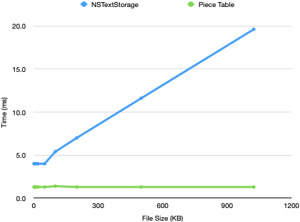

# Piece Tables (Part 1 of 2)
In Part 1, we created a simple app that can load, edit, and save plain text files. At the end of this part, we’re going to have... a simple app that can load, edit, and save plain text files. **But** we will have much more efficient data structure for editable text, and we’re going to have fun implementing it. This is just part 1 of 2 of building this data structure, though — we’ll build the data structure in this part, and then connect it to TextKit in the next part.

Let’s get started!

## The Theory
What’s so hard about editing text? Let’s ignore for the moment the problems with even *storing* Unicode text, with its encodings, multi-byte characters, etc. If you put those considerations aside, the abstract model for a text file is an array of characters. An array is about as simple a data structure as you can get. What’s the problem?

The answer, of course, is that **changing** things in an array can be expensive. Appending to or removing from the end of an array is cheap. Any other operation, though, means copying elements to make room for the new element (or to remove existing elements). And of course in a text editor, you want to make changes all throughout the text, not just at the end. That’s kind of *the point*. If your editor’s main data structure for text is “an array of characters”, it’s doing a ton of memory copying on every keystroke whenever the cursor is anywhere but the very end of the file.

So we need something better. But what?

One option is to store the file as a linked list of lines, and each line is an array of characters. You still need to do copying as you insert and remove characters, but you’re now only copying characters on the same line instead of all characters to the end of the file. If you’re implementing a source code editor, where you can assume that lines are all of a reasonable maximum length, you can get far with this approach.


Next up in sophistication is a data structure known as a *gap buffer*. The main idea behind a gap buffer is that edits to a text file aren’t randomly distributed throughout the text file — they exhibit a lot of locality. If you insert a character at offset 42 in the file, the next insertion is much more likely to be at offset 43 than any other location, and the next deletion is likely to be at offset 42 than any other location. Basically, where the cursor is is where edits are likely to be. A gap buffer makes edits at the cursor *really* cheap, but you pay a cost to move the cursor.

A gap buffer does this by storing the text in an array that’s much larger than what’s needed to store the text. This gives you a lot of free space inside the array (the “gap”), and the key insight is you can pay a cost to move the gap to the location of the cursor to make insertions and deletions at the cursor really cheap.


While you can implement world-class editors with a gap buffer, for Scrap Paper we’re going to use a third approach, called a *Piece Table*. Remember how we said that appending to the end of an array is cheap? The piece table exploits that by keeping two arrays. One read-only array contains the original file contents. The second **append-only** array contains all characters inserted at any time during the editing session. Finally, the *piece table* tells you how to build the file as a sequence of “pieces” from the different arrays.


Just as with the gap buffer, a piece table works efficiently because most edits to a text file are localized. When you insert character after character into the same spot, you’ll end up with a pretty compact representation of the “pieces” constructed from the two arrays. For example, I edited this file in a version of Scrap Paper that recorded all of the changes that I made to the text file (backspaces and all). At the end of my editing session of 2276 individual edits, I had 48 pieces representing the contents of the file.

## One more bit of theory: `String`, `NSString`, and unicode
I glossed over the challenges of representing text earlier. It’s now time to pay a little attention to that.

1. The Swift `String` struct and the Objective-C `NSString` class made different engineering choices about how to store and model strings. Swift models its strings as an array of “characters” and encodes those characters in UTF-8. The `NSString` class, in contrast, does not expose individual Unicode characters, and it uses UTF-16 encoding internally.
2. The TextKit classes are from the NSString era.
3. Since we will be interfacing a lot with TextKit, we’re going to use the NSString convention and model our text as an array of UTF-16 code points.

## Let’s build a Piece Table!
With the theory out of the way, it’s time to do some building.

``` swift
/// A piece table is a range-replaceable collection of UTF-16 values. At the storage layer, it uses two arrays to store the values:
///
/// 1. Read-only *original contents*
/// 2. Append-only *addedContents*
///
/// It constructs a logical view of the contents from an array of slices of contents from the two arrays.
public struct PieceTable {
  /// The original, unedited contents
  private let originalContents: [unichar]

  /// All new characters added to the collection.
  private var addedContents: [unichar]

  /// Identifies which of the two arrays holds the contents of the piece
  private enum PieceSource {
    case original
    case added
  }

  /// A contiguous range of text stored in one of the two contents arrays.
  private struct Piece {
    /// Which array holds the text.
    let source: PieceSource

    /// Start index of the text inside the contents array.
    var startIndex: Int

    /// End index of the text inside the contents array.
    var endIndex: Int
  }

  /// The logical contents of the collection, expressed as an array of pieces from either `originalContents` or `newContents`
  private var pieces: [Piece]

  /// Initialize a piece table with the contents of a string.
  public init(_ string: String) {
    self.originalContents = Array(string.utf16)
    self.addedContents = []
    self.pieces = [Piece(source: .original, startIndex: 0, endIndex: originalContents.count)]
  }
}
```

This code defines the stored properties we need for a piece table:

* `originalContents` is the read-only copy of the characters from the file we are trying to edit.
* `addedContents` is an append-only array of all characters added during an edit session.
* `pieces` describes the logical contents of the file as a series of contiguous characters from either `originalContents` or `addedContents`.

### Conforming to `Collection`

To make `PieceTable` feel Swift-y, we’re going to make it conform to a few standard protocols. First: `Collection` — this will let users read characters from a piece table as easily reading characters from an array. In Swift, a `Collection` is a data structure that contains elements that can be accessed by an index. If you’ve used arrays in Swift, you’ve used a collection.

The `Collection` protocol is big. While it contains over 30 methods, most of those have default implementations. To create a custom `Collection`, this is all you need to implement:

```swift
// The core methods of a Collection.
// Everything here should have O(1) complexity.
protocol Collection {
  associatedtype Element
  associatedtype Index: Comparable
  var startIndex: { get }
  var endIndex: { get }
  func index(after position: Index) -> Index
  subscript(position: Index) -> Element
}
```

If your only exposure to `Collection` has been through arrays, you may have assumed that the index needs to be an integer. Not so! The `Collection` protocol gives implementations a ton of flexibility about the index type. You can use any type so long as: 

1. You can efficiently return the index of the first element of the collection
2. You can efficiently return the index that means “you’ve moved past the last element of the collection”
3. Given an index, you can efficiently return the *next* index in the collection.

For our piece table, we are going to need a custom index type. To find a character in the piece table, we will use two values: The index of the piece in the `pieces` table, and then the index of the character within the contents array. With this information, we can easily figure out the character at an index (use the piece index find the correct contents array, then return the character at the correct character index). It’s a tiny bit more complicated to figure out the index that comes after the next index, because you have to consider two cases: If the current index represents a character at the end of a piece, you have to move to the next piece; otherwise you move to the next character in the current piece. 

With this overview, here is the minimal code to have a piece table conform to `Collection`:

```swift
extension PieceTable: Collection {
  public struct Index: Comparable {
    let pieceIndex: Int
    let contentIndex: Int

    public static func < (lhs: PieceTable.Index, rhs: PieceTable.Index) -> Bool {
      if lhs.pieceIndex != rhs.pieceIndex {
        return lhs.pieceIndex < rhs.pieceIndex
      }
      return lhs.contentIndex < rhs.contentIndex
    }
  }

  public var startIndex: Index { Index(pieceIndex: 0, contentIndex: pieces.first?.startIndex ?? 0) }
  public var endIndex: Index { Index(pieceIndex: pieces.endIndex, contentIndex: 0) }

  public func index(after i: Index) -> Index {
    let piece = pieces[i.pieceIndex]

    // Check if the next content index is within the bounds of this piece...
    if i.contentIndex + 1 < piece.endIndex {
      return Index(pieceIndex: i.pieceIndex, contentIndex: i.contentIndex + 1)
    }

    // Otherwise, construct an index that refers to the beginning of the next piece.
    let nextPieceIndex = i.pieceIndex + 1
    if nextPieceIndex < pieces.endIndex {
      return Index(pieceIndex: nextPieceIndex, contentIndex: pieces[nextPieceIndex].startIndex)
    } else {
      return Index(pieceIndex: nextPieceIndex, contentIndex: 0)
    }
  }

  /// Gets the array for a source.
  private func sourceArray(for source: PieceSource) -> [unichar] {
    switch source {
    case .original:
      return originalContents
    case .added:
      return addedContents
    }
  }

  public subscript(position: Index) -> unichar {
    let sourceArray = self.sourceArray(for: pieces[position.pieceIndex].source)
    return sourceArray[position.contentIndex]
  }
}
```

## Conforming to `RangeReplaceableCollection`
We can now iterate through the contents of a `PieceTable`. However, we don’t have a way to modify the contents of the `PieceTable`. To add this capability, we are going to make `PieceTable` conform to `RangeReplaceableCollection`. This protocol has a single required method, `replaceSubrange(_:with:)`. If you implement this method, you get a ton of other APIs for free.

For our implementation of `replaceSubrange`, we have to do two high-level jobs:

1. Append the new characters to the end of `addedContents`. Remember, in a piece table, we only ever add characters — never delete — and they always get added to the end of the array. This is the easy part.
2. The hard part: Update `pieces` to reflect the new contents of the file. The performance of the piece table will depend on how many entries are in `pieces`, so we need to take care to avoid creating unneeded items.

This implementation manages the complexity of updating the `pieces` array by creating a stand-alone *change description* that contains the new piece table entries. When constructing the change description, the implementation adheres to two rules to minimize the size of the `pieces` array:

1. No empty pieces! If an edit creates a `Piece` with no characters, it’s removed.
2. If it is possible to coalesce two neighboring pieces into one, do it.

Here is the code that adds conformance to `RangeReplaceableCollection`:

```swift
extension PieceTable: RangeReplaceableCollection {
  /// This structure holds all of the information needed to change the pieces in a piece table.
  ///
  /// To create the most compact final `pieces` array as possible, we use the following rules when appending pieces:
  ///
  /// 1. No empty pieces -- if you try to insert something empty, we just omit it.
  /// 2. No consecutive adjoining pieces (where replacement[n].endIndex == replacement[n+1].startIndex). If we're about to store
  ///   something like this, we just "extend" replacement[n] to encompass the new range.
  private struct ChangeDescription {

    private(set) var values: [Piece] = []

    /// The smallest index of an existing piece added to `values`
    var lowerBound: Int?

    /// The largest index of an existing piece added to `values`
    var upperBound: Int?

    /// Adds a piece to the description.
    mutating func appendPiece(_ piece: Piece) {
      // No empty pieces in our replacements array.
      guard !piece.isEmpty else { return }

      // If `piece` starts were `replacements` ends, just extend the end of `replacements`
      if let last = values.last, last.source == piece.source, last.endIndex == piece.startIndex {
        values[values.count - 1].endIndex = piece.endIndex
      } else {
        // Otherwise, stick our new piece into the replacements.
        values.append(piece)
      }
    }
  }

  /// If `index` is valid, then retrieve the piece at that index, modify it, and append it to the change description.
  private func safelyAddToDescription(
    _ description: inout ChangeDescription,
    modifyPieceAt index: Int,
    modificationBlock: (inout Piece) -> Void
  ) {
    guard pieces.indices.contains(index) else { return }
    var piece = pieces[index]
    modificationBlock(&piece)
    description.lowerBound = description.lowerBound.map { Swift.min($0, index) } ?? index
    description.upperBound = description.upperBound.map { Swift.max($0, index) } ?? index
    description.appendPiece(piece)
  }

  /// Update the piece table with the changes contained in `changeDescription`
  mutating private func applyChangeDescription(_ changeDescription: ChangeDescription) {
    let range: Range<Int>
    if let minIndex = changeDescription.lowerBound, let maxIndex = changeDescription.upperBound {
      range = minIndex ..< maxIndex + 1
    } else {
      range = pieces.endIndex ..< pieces.endIndex
    }
    pieces.replaceSubrange(range, with: changeDescription.values)
  }

  /// Replace a range of characters with `newElements`. Note that `subrange` can be empty (in which case it's just an insert point).
  /// Similarly `newElements` can be empty (expressing deletion).
  ///
  /// Also remember that characters are never really deleted.
  public mutating func replaceSubrange<C, R>(
    _ subrange: R,
    with newElements: C
  ) where C: Collection, R: RangeExpression, unichar == C.Element, Index == R.Bound {
    let range = subrange.relative(to: self)

    // The (possibly) mutated copies of entries in the piece table
    var changeDescription = ChangeDescription()

    safelyAddToDescription(&changeDescription, modifyPieceAt: range.lowerBound.pieceIndex - 1) { _ in
      // No modification
      //
      // We might need to coalesce the contents we are inserting with the piece *before* this in the
      // piece table. Allow for this by inserting the unmodified piece table entry that comes before
      // the edit.
    }
    safelyAddToDescription(&changeDescription, modifyPieceAt: range.lowerBound.pieceIndex) { piece in
      piece.endIndex = range.lowerBound.contentIndex
    }

    if !newElements.isEmpty {
      // Append `newElements` to `addedContents`, build a piece to hold the new characters, and
      // insert that into the change description.
      let index = addedContents.endIndex
      addedContents.append(contentsOf: newElements)
      let addedPiece = Piece(source: .added, startIndex: index, endIndex: addedContents.endIndex)
      changeDescription.appendPiece(addedPiece)
    }

    safelyAddToDescription(&changeDescription, modifyPieceAt: range.upperBound.pieceIndex) { piece in
      piece.startIndex = range.upperBound.contentIndex
    }

    applyChangeDescription(changeDescription)
  }
}
```

## Does it make a difference?
For large file sizes, yes!

I gathered a trace of all of the edits I made to a text buffer for a couple of minutes of editing a file. I then replayed that trace on an `NSTextStorage` object and on a `PieceTable`, timing how long it took to perform all of the edits on files of different sizes. This is the result:



For the `NSTextStorage`, the time to perform the edits increases linearly with the file size. For `PieceTable`, however, the time to perform the edits is independent of file size; `PieceTable` operations will get slower as the complexity of the edit history increases.

## What comes next?
At this point we have the basics of a more efficient data structure for editing plain text. In the next installment, we’ll connect this data structure to TextKit so Scrap Paper will use it!

## Exercises for the Reader
1. (Easy) We made PieceTable conform to `Collection`. With a collection, you can *only* traverse forwards through the collection. Make the `PieceTable` conform to `BidirectionalCollection` by implementing `index(before index: Index)`.
2. (Medium) The bare-minimum conformance to `Collection` works, but is only efficient if you always start at the first index and move one-by-one through each character. Our piece table cannot conform to `RandomAccessCollection` (we cannot measure the distance between two indexes in O(1)), but we can still make it significantly more efficient to move to different positions in the piece table by implementing `index(_, offsetBy:)` and `distance(from:to:)`. 
